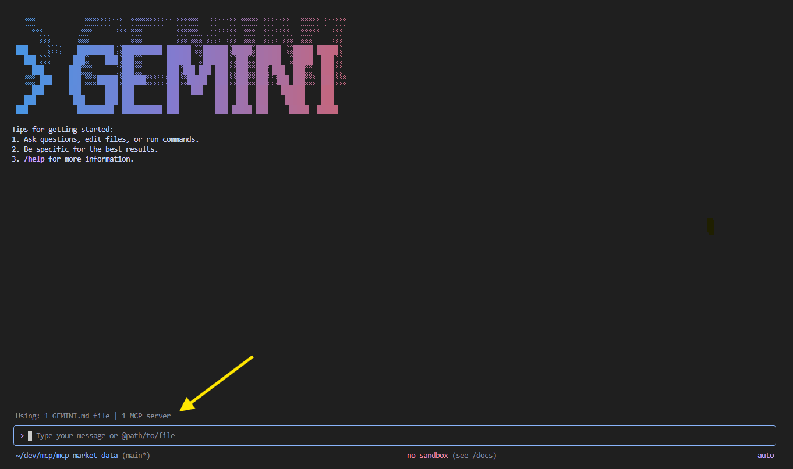
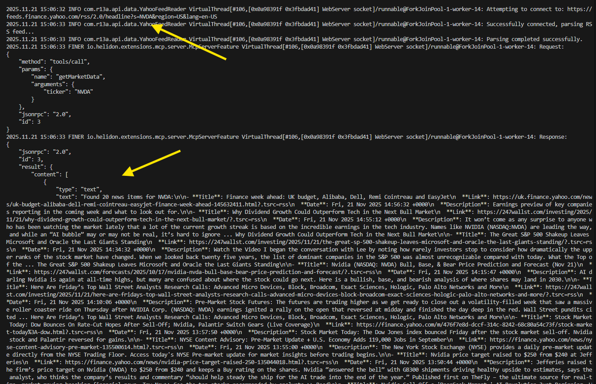
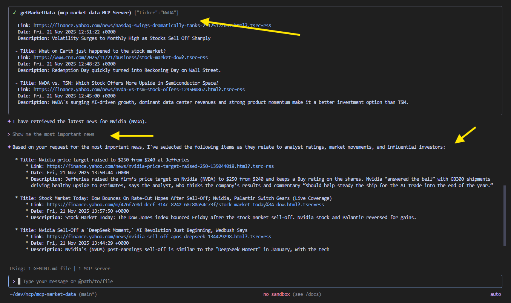

# MCP Market Data Server

## Overview

This project is an example of a Model Context Protocol (MCP) server built with Java using the Helidon framework. 

The MCP (Model Context Protocol) enables integration with Large Language Models (LLMs) and returns financial market news from the American stock market based on a specified ticker symbol. This server provides real-time access to market-related news, allowing LLMs to retrieve current financial information for informed responses.

### Running the Project

To execute the MCP server:

```bash
mvn clean package
java -jar target/mcp-market-data.jar
```

The server will start on port 8060 and be ready to accept MCP requests.

## Prerequisites

### Installing Gemini-CLI for Linux

This project uses Gemini-CLI for Linux as the client application. To install Gemini-CLI:

1. Download the latest release from the official repository
2. Extract the binary to a directory in your PATH
3. Make the binary executable: `chmod +x gemini`
4. Verify installation: `gemini --version`

For detailed installation instructions, please refer to the official Gemini-CLI documentation.

### Configuring the Local MCP Server

After installing Gemini-CLI, you need to register the local MCP server with the client application. Run the following command:

```bash
gemini mcp add mcp-market-data --transport http http://localhost:8060/mcp
```

This command registers the `mcp-market-data` server running on your local machine at port 8060.

## Running a Test

The following sequence demonstrates how the MCP server integrates with Gemini-CLI to retrieve financial news.

### Step 1: Initial Query



When starting the tool, it displays that an MCP service is connected and available.

### Step 2: MCP Function Authorization


When analyzing the request, the system identifies that a related service can be used and requests authorization to proceed.

### Step 3: Service Execution



This shows the result of the service execution by the MCP server.

### Step 4: Final Results



A request is made to display a news item, and the LLM returns the response.

## Summary

This project demonstrates a complete integration between a Java-based MCP server using Helidon and an LLM client (Gemini-CLI). The server acts as a bridge between language models and real-time financial data sources, enabling natural language queries about stock market news.

Key highlights:
- **Java & Helidon**: Robust server implementation using modern Java frameworks
- **MCP Protocol**: Seamless integration with LLM clients through the Model Context Protocol
- **Real-time Data**: Access to current financial news from the American stock market
- **Security**: Built-in authorization flow for external function calls
- **Ease of Use**: Simple natural language interface for querying market data

This example showcases how MCP servers can extend LLM capabilities by providing access to specialized, real-time data sources, making AI assistants more powerful and contextually aware in specific domains like financial markets.
